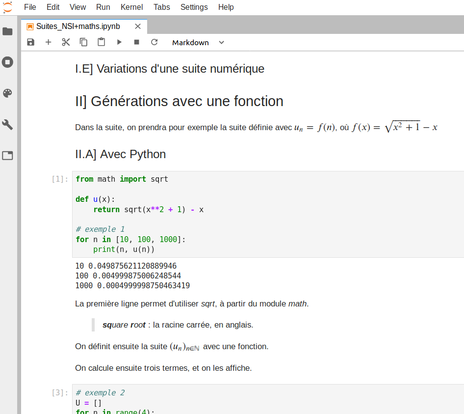

---
export_on_save:
  html: true
---


# Découverte de Jupyter {ignore=true}

@import "assets/Jupyter.svg" {width="300px" height="200px" title="Logo de Jupyter" alt="logo de Jupyter"}

Jupyter est une solution logicielle qui permet de créer des carnets pour inclure des cellules de code en Python, et des cellules de texte avec une mise en forme la plus simple, grâce à la syntaxe *Markdown*.

Ces carnets sont très utiles et commodes en sciences.
- Pour créer des supports de cours, d'exercices, ou des devoirs, nécessitant la visualisation ou l'exécution de code. Ou pas !
- Le rendu est assuré par un navigateur web seul. On peut se passer de tout autre logiciel. Tout élève peut l'utiliser sur n'importe quelle machine ayant un navigateur connecté.
- Pour la vidéoprojection, le format HTML permet un zoom avec la mise en page automatique. On peut aussi imprimer facilement.
- On peut partager en ligne un document, le visualiser, et utiliser du code.
- On peut aussi travailler déconnecté, pour une garantie de confidentialité, et d'autonomie.

Ci-dessous un document en cours d'élaboration.



## Sommaire {ignore=true}

[TOC]

## :fa-cog: Comment utiliser Jupyter

### Utilisation en ligne

#### Avec *Try Jupyter*

<!-- @import "../assets/try-jupyter.png" {width="200px" title="Logo de l'Éducation Nationale" alt="Un logo de Jupyter Lab"}-->


Il est possible d'essayer Jupyter avec une feuille par défaut.
- Aller sur [https://jupyter.org/try](https://jupyter.org/try)
- Choisir **Try JupyterLab**
- Attendre quelques instants
- Une page de démonstration se charge
  - elle est interactive
  - vous pouvez la modifier
  - vous pourrez en créer une vous-même bientôt.
- :fa-bolt: Attention. En classe, cette solution n'est pas fiable ; le serveur est parfois surchargé.
- Cette solution est adaptée pour qu'un élève puisse faire un devoir maison sans avoir à installer de logiciel chez lui.

#### Avec *GitHub*

<!-- @import "../assets/github-logo.png" {width="200px" title="Logo de GitHub" alt="Un logo de GitHub"}-->


Il est possible de sauvegarder en ligne vos carnets Jupyter sur la plateforme [GitHub](https://github.com/), et ainsi de les partager facilement.
- Les carnets sont visibles en statique :
  - ils ne peuvent pas être modifiés sur place,
  - ils ne peuvent pas lancer les bouts de code,
  - ils peuvent seulement être lus, et pointer vers d'autres liens.
- La fiabilité des serveurs est très bonne. L'éthique peut-être un peu moins bonne ; pour ceux que cela touche, il existe d'autres excellentes solutions comme [GitLab](https://about.gitlab.com/) ou [FramaGit](https://framagit.org/public/projects).

#### Avec *My Binder*

<!-- @import "../assets/binder.svg" {width="200px"} -->

[Cette solution](https://mybinder.org/) permet de rendre dynamique les carnets stockés sur *GitHub*, *GitLab* et d'autres dépôts encore.

L'exemple proposé par *Try Jupyter* repose sur *Binder*.
**À vous** de créer vos propres carnets et les mettre en ligne !

### Utiliser Jupyter sur son poste

#### Avec Anaconda

<!-- @import "../assets/anaconda.png" {width="200px" title="Logo d'Anaconda" alt="Un logo d'Anaconda"} -->

- Le moyen le plus simple d'obtenir JupyterLab est de passer par la [distribution Anaconda](https://www.anaconda.com/distribution/).
- Il faut bien suivre [les étapes d'installation](https://docs.anaconda.com/anaconda/).

### Des exemples de carnets

Voici [des exemples de carnets](https://mybinder.org/v2/gh/FranckCHAMBON/Python-Lycee/master?filepath=Carnets), un mélange de cours, exercices et codes. Il y a, par exemple :
- un qui présente les nombres de Mersenne ;
- un qui présente la simulation de la loi binomiale ;
- un sur la méthode de Héron
- ...

### A tour of possibilities

[A curated list of awesome Jupyter projects, libraries and resources.](https://github.com/markusschanta/awesome-jupyter)

## :fa-list: Découvrir le *Markdown*, avec quelques exemples

### Motivation
Jupyter propose ses zones de texte en [Markdown](https://fr.wikipedia.org/wiki/Markdown) ; ce qui permet une saisie de texte rapide avec une qualité de rendu HTML. En fait, on peut écrire aussi quelques balises HTML lorsque les balises Markdown sont limitées.
> En particulier, pour insérer des images et choisir des attributs, on utilisera la balise html ``.
> Le Markdown est volontairement limité à l'essentiel pour rester simple.

### Liste de tutoriels pour écrire en Markdown
Suivant votre goût pour l'anglais et votre temps :
* https://www.markdowntutorial.com/ _in english by GitHub_
* [Syntaxe assez complète](https://michelf.ca/projets/php-markdown/syntaxe/)
* [another, in english, by GitHub](http://agea.github.io/tutorial.md/)
* [Un résumé assez succinct](https://github.com/luong-komorebi/Markdown-Tutorial/blob/master/README_fr.md)
* [Élaboration et conversion de documents avec Markdown et Pandoc](https://enacit1.epfl.ch/markdown-pandoc/) ; pour les utilisateurs avancés.

Il ne faut **que 5 minutes pour avoir les bases** suffisantes pour la suite.

On reprend ci-dessous l'essentiel.

### Quelques exemples de mise de style

#### L'emphase faible et forte
L'emphase
: Dans un texte, on a souvent envie de mettre en ***relief*** *certains* **mots**. Il y a plusieurs possibilités : *italique*, **gras**, ~~barré~~, <sup>en haut</sup>, <sub>en bas</sub>, <kbd>cadre</kbd>, `police`, couleur, ou même un mélange. On peut aussi avoir envie de changer le style de tout un groupe de mots que l'on avait identifié. Cela se fait avec une feuille de style en cascade (CSS). Cela permet de faire évoluer la charte graphique d'un document d'un seul coup. C'est une bonne pratique. L'emphase faible sera pour mettre un peu de relief, par défaut c'est en *italique*. L'emphase forte, **par défaut est en gras** ; il est conseillé de limiter au maximum son utilisation hors des titres. L'emphase forte doit rester exceptionnelle, au prix de ne plus avoir d'impact.
```
Du _texte en italique_ entouré de la balise tiret bas *ou* une étoile.
```
> Du _texte en italique_ entouré de la balise tiret bas *ou* une étoile.

```
Du **texte en gras** entouré de la balise double étoile, __ou__ double tiret bas.
```
> Du **texte en gras** entouré de la balise double étoile, __ou__ double tiret bas.

```
**_Un_** exemple _avec_ tous *les* cas *__possibles__*, **fort1** ou __fort2__.
```
> **_Un_** exemple _avec_ tous *les* cas *__possibles__*, **fort1** ou __fort2__.

```
**Un dernier _exemple_** : _une section italique avec un mot en **gras**._
```
> **Un dernier _exemple_** : _une section italique avec un mot en **gras**._

#### Les listes numérotées ou non
```
* On peut faire des listes non numérotées :
    + avec des sous-listes imbriquées ;
    + un autre item ;
    + un dernier pour l'exemple.
* Ou des listes numérotées :
    1. première étape ;
    4. la numérotation est automatique
    2. on peut donc aussi y inclure d'autres listes :
        - un ;
        - deux :
            1. alors ?
            2. facile ?
```

* On peut faire des listes non numérotées :
    + avec des sous-listes imbriquées ;
    + un autre item ;
    + un dernier pour l'exemple.
* Ou des listes numérotées :
    1. première étape ;
    4. la numérotation est automatique
    2. on peut donc aussi y inclure d'autres listes :
        - un ;
        - deux :
            1. alors ?
            2. facile ?


#### Les entêtes, les titres (*header*)
Pour créer l'architecture d'un document, on place des titres de niveaux variés avec autant de `#`.
> L'indentation n'est pas obligatoire ici, c'est juste à titre pédagogique.

```
# Gros titre       (niveau 1)
##  Partie 1       (niveau 2)
###     Section a  (niveau 3)
###     Section b
####        sous section
Un paragraphe...
####        autre sous section
Un autre paragraphe
##  Partie 2
###     Section a
On peut avoir jusqu'à 6 niveaux de titres
```

#### Liens et images
##### insérer un lien direct
```
On peut écrire directement une url,
 exemple avec www.startpage.com un moteur de recherche,
 ou bien https://duckduckgo.com/
```
On peut écrire directement une url,
 exemple avec www.startpage.com un moteur de recherche,
 ou bien https://duckduckgo.com/

##### insérer un lien simple
```
Un lien vers [Qwant](https://www.qwant.com/ "Le seul européen") un moteur de recherche.
```
Un lien vers [Qwant](https://www.qwant.com/ "Le seul européen") un moteur de recherche.

> Noter l'info bulle ; optionnelle.

##### lien dans un titre avec un peu d'emphase
```
###### Un lien vers [*LinuxFr*.org](https://linuxfr.org/) dans un titre
```
###### Un lien vers [*LinuxFr*.org](https://linuxfr.org/) dans un titre
> On peut imbriquer les balises, et donc mettre des liens dans des listes, ou des images dans des liens...

##### insérer une image
Syntaxe :
```

```
> Pour l'insertion d'images avec plus de réglages, on utilise les balises HTML.

**Exemple :**
Votre fichier image doit être accessible en local ou sur Internet.
```

```

<!-- @import "assets/Markdown.svg" -->

### Exercices de Markdown à réaliser avec JupyterLab
#### Exercice 1 : modifier un carnet déjà créé

1. [Ouvrir ce carnet](https://mybinder.org/v2/gh/FranckCHAMBON/Python-Lycee/master?filepath=Carnets%2Fmaths%2FSyracuse.ipynb) sur les suites de Syracuse.
2.  Le compléter en puisant des informations sur Internet.
3. Ajouter des images.
4. Ajouter des listes numérotées ou non, d'autres titres (*header*), mettre de l'emphase.
5. Étudier comment ajouter une cellule, lui faire changer de status (code ou Markdown).
6. Étudier comment couper une cellule en deux (*split cell*).


#### Exercice 2 : la création d'un premier carnet

<!-- @import "../assets/notebook-py3.png" {width="200px" title="Notebook Python3" alt="Notebook Python3"} -->

- Lancer JupyterLab
- Créer un nouveau carnet : **Notebook Python 3**
- Dans une ou plusieurs cellules Markdown, écrire un énoncé d'exercice qui peut nécessiter un code pour sa résolution.
- Dans une ou plusieurs cellules de code, écrire une solution.
- Ajouter des cellules de textes si nécessaire.
- En cas de manque d'inspiration, jeter un œil à [Project Euler](https://projecteuler.net/archives) et proposer une traduction française d'un exercice simple à résoudre.
- **Conseil** : Créer un carnet qui reprend vos brouillons de recherche pour l'exercice (Nombre d'écritures d'un entier comme une somme) qui se trouve presque à la fin du cours sur (Python et éditeur). Cet exercice  ne nécessite pas d'écriture mathématique complexe, mais se révèle riche à la réflexion.

Le carnet vous permet d'organiser vos différentes pistes de recherche, inclure des résultats, faire des tests de code. C'est la force et la faiblesse des carnets ; un brouillon peut rester brouillon, mais peut aussi montrer une belle évolution.


## :fa-object-group: Premiers graphiques

On utilise [*matplotlib*](https://matplotlib.org/) pour tracer des graphiques de qualité dans *Jupyter*.

Il faut commencer par une cellule de code avec

```python
%matplotlib inline
```

Cette ligne permet d'insérer les graphiques dans le carnet. Il serait aussi possible d'avoir les graphiques dans une boîte de dialogue.

```python {cmd}
import matplotlib.pyplot as plt
```

Cette seconde ligne importe le module et le renomme `plt` pour plus de simplicité, ensuite, dans notre carnet seulement. On aurait techniquement pu choisir un autre nom que `plt`.

### Représentation d'une suite

```python {cmd continue matplotlib}
def suivant(u):
    if u % 2 == 0:
        return u // 2
    else:
        return 3 * u + 1

u = 121
liste_u = [u]
while u != 1:
  u = suivant(u)
  liste_u.append(u)

plt.plot(liste_u, "ro")
plt.show()
```

On a défini une fonction `suivant` et une suite définie par récurrence.

Deux lignes ont suffi à avoir le graphique.
* La première construit le graphique dont les points ont les ordonnées passées en paramètre ; une liste. Ensuite, `"ro"` correspond à rouge ( _**r**_*ed* ), et des p**o**ints. On peut choisir `"bx"` pour des croix bleues.
* La seconde affiche le graphique.

Il est possible d'ajouter des titres aux axes, ainsi qu'une légende au graphique.

### Représentation d'une fonction

Le plus simple est de construire une liste d'abscisses et de calculer ensuite la liste des ordonnées associées. Voici un exemple.


```python {cmd matplotlib}
from math import cos, sqrt
def f(x):
  return cos(sqrt(20 + x))

x_min = -20.0
x_max = 60.0
n = 100 #nb de points

X = [x_min + (x_max - x_min) * i / n for i in range(n)]
Y = [f(x) for x in X]
plt.plot(X, Y)
plt.show()
```

Il suffira de copier le code ci-dessus, modifier votre fonction, ainsi que l'intervalle de définition et le nombre de points.

Pour aller plus loin : un premier tutoriel [en anglais](https://matplotlib.org/tutorials/introductory/pyplot.html#sphx-glr-tutorials-introductory-pyplot-py).
