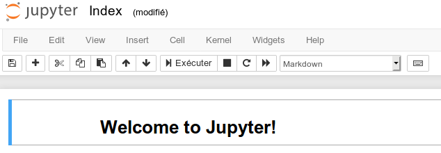

<center>


</center>

# _Python_ au lycée - une présentation
Auteur : <a href="mailto:franck.chambon@ac-aix-marseille.fr">Franck CHAMBON</a>

## Le choix de _Python_, et de _Jupyter_

Dans le [bulletin Officiel](https://cache.media.education.gouv.fr/file/SP1-MEN-22-1-2019/26/8/spe633_annexe_1063268.pdf) du programme de NSI, on trouve la justification du choix de _Python_ :
> **Modalités de mise en œuvre**
>>Les activités pratiques et la réalisation de projets supposent, pour chaque élève, l’accès à un équipement relié à internet. Un langage de programmation est nécessaire pour l’écriture des programmes :  un  langage simple d’usage, interprété, concis, libre et gratuit, multiplateforme, largement répandu, riche de bibliothèques adaptées et bénéficiant d’une vaste communauté d’auteurs dans le monde éducatif  est  à  privilégier.  Au  moment  de  la  conception  de  ce  programme,  le  langage  choisi est Python version 3 (ou supérieure). L’expertise dans tel ou tel langage de programmation n’est cependant pas un objectif de formation.


L'utilisation de _Python_ au lycée est retenue ou possible :
- [x] en NSI (Numérique et Science de l'Informatique),
- [x] en maths, pour la partie algorithmique du programme,
- [x] en SNT, pour les élèves de seconde,
- [x] en science physique et en chime,
- [ ] en SVT,
- [ ] en économie.

Il y a plusieurs façons d'utiliser _Python_ :
* il y a divers services en lignes, ideone.com par exemple
* on peut installer divers logiciels plus ou moins sophistiqués.
>Pour accéder facilement à _Python_, cette présentation propose _Jupyter_.

<center>

</center>

[Jupyter](https://fr.wikipedia.org/wiki/Jupyter "Article détaillé sur Wikipédia") est une application web qui permet de produire des documents scientifiques
contenant :
* Des cellules de code (_Python_, mais aussi _Julia_, _R_ et d'autres).
* Des cellules de texte mis en forme avec _Markdown_ ou _HTML_,
  * avec des formules mathématiques en _LaTeX_.

<center>


</center>

> On appelle ces documents des carnets, des calepins ou des _notebooks_.

La philosophie du [_Project Jupyter_](https://en.wikipedia.org/wiki/Project_Jupyter#Philosophy "Philosophy") est de ne proposer que des logiciels libres.


Voici un exemple de code _Python_ qui calcule le produit des 100 premiers entiers non nuls :

```Python
produit = 1
for nombre in range(1, 101):
    # une boucle pour 'nombre' allant de 1 inclus, à 101 exclu
    produit = produit * nombre
print(produit)
```

>Et le résultat : 93326215443944152681699238856266700490715968264381621468592963895217599993229915608941463976156518286253697920827223758251185210916864000000000000000000000000

Voici un exemple de représentation graphique, avec un paramètre commandé par un curseur.


Un _notebook_ peut ensuite être converti en divers formats ouverts :
* HTML ou Markdown,
* PDF, Présentation,
* LaTeX, LibreOffice document,
* et d'autres encore.


> **À retenir** : _Jupyter_ est facilement accessible, soit en l'installant, soit en accédant à un service en ligne. Une solution alternative comme _PyCharm_ conviendra plus aux étudiants post-BAC ; l'installation et l'utilisation étant plus complexes.


 Cette présentation, et les cours qui suivent, ont été créés avec _Jupyter_. Ces documents sont placés sous licence libre [CC - BY-NC-SA](https://creativecommons.org/licenses/by-nc-sa/4.0/legalcode.fr); ils sont accessibles gratuitement, peuvent être modifiés, adaptés, étoffés, quitte à citer les différents auteurs. Leur utilisation commerciale n'est pas acceptée. 'à affiner... TODO'


## Exemples de _notebooks_ créés avec Jupyter et Python
Les carnets sont [très utilisés dans le monde éducatif](https://github.com/jupyter/jupyter/wiki/A-gallery-of-interesting-Jupyter-Notebooks), mais aussi pour une simple publication.
* [Mathématiques](https://github.com/FranckCHAMBON/L1-Math-Info---Arith), (auto-promotion)
* [Informatique](https://nbviewer.jupyter.org/github/ganeshutah/Jove/blob/master/notebooks/driver/Drive_Jove_Gallery_Examples.ipynb)
* [Physique](https://nbviewer.jupyter.org/github/numerical-mooc/numerical-mooc/blob/master/lessons/01_phugoid/01_01_Phugoid_Theory.ipynb), [Chimie](https://nbviewer.jupyter.org/gist/greglandrum/4316433),
* [SVT](http://readiab.org/),
* [Psychologie](https://nbviewer.jupyter.org/github/wtadler/cue-combination-with-neurons/blob/master/neural_cue_combination.ipynb),
* [Économie](https://nbviewer.jupyter.org/github/vincentarelbundock/Reinhart-Rogoff/blob/master/reinhart-rogoff.ipynb),
* etc.

> Certains blogs sont écrits avec ces technologies, tel que l'excellent [XKCD](https://what-if.xkcd.com/73/).

Ci-dessous, quelques représentations graphiques.


Dans cet [article](https://linuxfr.org/news/python-pour-les-sciences-une-presentation) certaines bibliothèques scientifiques sont présentées pour les chercheurs et les scientifiques.

Nous aborderons dans ce cours :
* [Jupyter](https://jupyter.org/ "Site officiel"), pour le codage et la réalisation de documents :
* [matplotlib](https://matplotlib.org/ "Site officiel"), pour la création de graphiques ;
* [pandas](https://pandas.pydata.org/ "Site officiel"), pour l'analyse de données ;
* [SciPy](https://scipy.org/), pour le calcul scientifique ;
* [ipyleaflet](https://github.com/jupyter-widgets/ipyleaflet/blob/master/README.md), pour la cartographie et le positionnement par satellites. (voir aussi folium)

Avant de découvrir ces bibliothèques, il faudra d'abord avoir une initiation :
* Aux concepts élémentaires du _HTML_, langage à la base de tout le web.
* Au langage léger _Markdown_, plus rapide à écrire et facile à lire que le _HTML_, utilisé dans _Jupyter_.
* À l'écriture de mathématiques simples, avec des formules _LaTeX_.
* Au langage _Python_ lui-même, par le biais de nombreuses activités.
> Ces notions sont totalement indépendantes et complémentaires pour l'élaboration d'un carnet _Jupyter_.


## Public visé par cette présentation
* Les enseignants qui souhaitent se former, et proposer de nouveaux documents.
* Les lycéens en SNT ou NSI, pour leur apprentissage.
* Qui souhaite facilement écrire et publier un document incluant du code ou des sciences.

## Utilisation
L'utilisation de Jupyter pour créer un document se fait de plusieurs manières possibles :
* En ligne, pour tester sans inscription, avec [Try Jupyter](https://jupyter.org/try) : **idéal pour débuter, expérimenter**.
* En ligne, avec [CoCalc](https://cocalc.com/) : **inscription nécessaire**, service complet et puissant.
* En l'**installant sur votre machine**.
    + Il est recommandé d'utiliser [Anaconda](https://docs.anaconda.com/anaconda/install/).
    + Demander à l'avoir sur tous vos postes au lycée : salles info, CDI, salles de classe.
    + Idem au collège, en entreprise, ce sera toujours utile.
* En installant [SageMath](http://www.sagemath.org/fr/), **pour les utilisateurs avancés**.

Pour diffuser un document créé :
* La lecture d'un _notebook_ est possible directement dans [GitHub](https://github.com/).
* La lecture peut se faire aussi via [NbViewer](https://nbviewer.jupyter.org/). (← la galerie vaut le détour)
* Rappel : il peut aussi être exporté en PDF, HTML, vidéo-projeté, ou imprimé...


## Premier exemple
Aller sur [Try Jupyter](https://jupyter.org/try) puis cliquer sur _Try Jupyter with Python_.



De là, on peut ou bien :
* Cliquer sur <kbd>+</kbd> situé sous _File_ et _Edit_, pour avoir une nouvelle cellule
* Cliquer sur <kbd>File</kbd> → <kbd>New Notebook</kbd> → <kbd>Python3</kbd>, pour avoir une nouvelle feuille

Vérifier comment modifier le genre de votre cellule (_Code_ ou _Markdown_).
* _Markdown_ servira à créer des cellules de texte, avec liens, images, tableaux, ...
* _Code_ servira à créer des cellules avec du code Python que l'on peut exécuter.

Vérifier que _Jupyter_ sait calculer `2+2` dans une cellule _Code_.

Pour lancer une cellule (_Code_ ou _Markdown_), il faut terminer l'écriture par : <kbd>⇑MAJ.</kbd> + <kbd>↵ENTRÉE</kbd>
(ou bien <kbd>⇑SHIFT</kbd> + <kbd>↵RETURN</kbd>).


**Exercice**
Copier/coller le texte ci-dessous dans une cellule _Code_, et lancer la avec <kbd>⇑MAJ.</kbd> + <kbd>↵ENTRÉE</kbd>

```Python
total = 0
for k in range(1000):
    total = total + k**2
print(total)

#variante
print( sum(k**2 for k in range(1000)) )
```

Copier/coller le texte ci-dessous dans une cellule, **changer le genre en Markdown**, puis lancer la avec <kbd>MAJ.</kbd>+<kbd>ENTRÉE</kbd>.

```Markdown
Ci-dessus, voici deux façons d'écrire du code _Python_ pour calculer
 la somme des carrés des entiers **inférieurs** à 1000.
* `range(1000)` est un itérateur qui permet de faire une boucle sur les entiers inférieurs à 1000.
* vous apprendrez à coder avec Python dans une autre partie du cours. Patience.

En maths, on écrit cette somme $\sum\limits_{k=0}^{999}k^2$, ou bien
\[0^2 + 1^2 + 2^2 + 3^2 + 4^2 + \dots + 997^2 + 998^2 + 999^2\]
```

 Le résultat attendu (même s'il vous reste des points obscurs) doit être :


Modifier ces deux cellules pour faire quelques expérimentations, et essayer de comprendre leurs effets. Par exemple :
* Dans la cellule _Code_ :
    * Remplacer `total = 0` par `total = 7`, lancer la cellule.
    * Remettre ensuite `total = 0`.
    * Remplacer `range(1000)` par `range(4)`.
    * Remplacer `k**2` par `k**3`.
* Dans la cellule _Markdown_ :
    * Mettre de nouveaux mots en gras, ou en italique, ou les deux.
    * Essayer d'ajouter de l'espace entre les mots, ou de sauter des lignes. Curieux ?
    * Si vous avez accès à la version _Markdown_ de ce document, regardez-en le contenu !
    * **On apprend beaucoup par l'exemple !**

## La suite des découvertes

Après cette introduction, présentation de _Jupyter_, le programme à venir :

1. Acquérir des [notions de base sur les balises _HTML_](1-Notions-HTML.md) ;
2. Découvrir le [_Markdown_, par l'exemple](2-Markdown-exemples.md) ;
3. Écrire des [maths simples](3-Maths-simples.md) dans un document ;
4. Découvrir [_Python_](4-Python-bases.md) et les cellules de code.
5. [Activités complètes avec _Jupyter_](5-Acti-Python.md), _Markdown_ et _Python_.
    + le gros de l'apprentissage, surtout pour _Python_ et l'algorithmique,
    + la création de graphiques,
    + l'utilisation de bases de données,
    + la cartographie et les coordonnées _GPS_,
    + ~~les jeux en 3D~~,
    + ~~le montage vidéo~~,
    + etc.
6. Découvrir [SageMath](6-Intro-Sagemath.ipynb) ; plutôt pour les enseignants de mathématiques.

Pour finir, après une bonne phase d'apprentissage, pour les utilisateurs avancés, il faut savoir que Jupyter est aussi utilisé pour travailler avec [SageMath](http://www.sagemath.org/fr/ "Site officel"), un logiciel puissant de calcul formel utilisé par les plus grands scientifiques. On peut s'en servir en maths dès le lycée.
